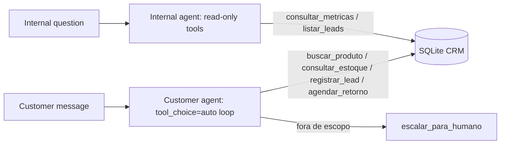

<div align="center">


[](https://github.com/vitormigli/sales-agent-evals/actions/workflows/ci.yml)


</div>

Two tool-using agents over a fictional store's CRM: a customer-facing sales/support
agent (product search, stock, lead capture, follow-up scheduling) and an internal
ops agent (read-only metrics and lead lookups) — evaluated with simulated customer
conversations, not just single-turn prompts.

## Demo

```bash
docker compose up
```

Streamlit chat (both agents, two tabs) at `http://localhost:8501`; API docs at
`http://localhost:8000/docs`.

## Architecture



## Results

30 scenarios was the plan's target; this MVP runs a smaller set to control real API
spend — see [`evals/results.md`](evals/results.md) for the full breakdown and the
raw simulated transcripts in `evals/transcripts/`.

| Metric | Value |
|---|---|
| Task completion rate | 87.5% (7/8) |
| Guardrail violations (price hallucination) | 0 |
| Avg. turns to completion | 2.5 |

The one failing scenario is a real bug, not a flaky eval: the customer asked about a
product that exists in the catalog (`Monitor 27" UltraWide Nimbus`), but
`find_products`'s naive substring match fails whenever the query and the catalog
name don't line up character-for-character — here, tripped up by the embedded `"`
(inches) character. The agent correctly refused to invent availability information
it didn't have; it just couldn't find the product to check. The fix is a better
retrieval layer — literally the same problem
[`hybrid-search-ptbr`](https://github.com/vitormigli/hybrid-search-ptbr) in this
portfolio was built to solve.

## Technical decisions and trade-offs

- **OpenAI instead of Claude for this project**: budget-driven — see
  [`docs/decisions/0002-openai-for-this-project.md`](docs/decisions/0002-openai-for-this-project.md).
- **SQLite instead of Postgres for the CRM**: a single-file, zero-setup database is
  enough for a fictional CRM this size and keeps `docker compose up` fast; see
  [`docs/decisions/0001-sqlite-crm.md`](docs/decisions/0001-sqlite-crm.md).
- **Structured JSON-lines tool-call logging instead of self-hosted Langfuse**: full
  tracing (every tool call, arguments, and result) is logged and inspectable per
  scenario without standing up an extra service — a pragmatic swap for a portfolio
  project, documented as a limitation below rather than silently downscoped.
- **Simulated scheduling, no real Google Calendar integration**: `agendar_retorno`
  writes to the fictional CRM; wiring a real calendar is a credentials/OAuth problem
  orthogonal to the agent-design work this project demonstrates.
- **Heuristic guardrail check**: a lightweight regex-based checker
  (`src/sales_agent/guardrails.py`) flags when the agent states a price that wasn't
  actually returned by a tool call — catches the specific hallucination the system
  prompt tries to prevent, without needing an LLM-judge pass.

## How to run

```bash
cp .env.example .env   # add your OPENAI_API_KEY
docker compose up
```

Or locally with [`uv`](https://docs.astral.sh/uv/):

```bash
uv sync
make test   # unit tests (CRM, tools, guardrail heuristic — no API calls)
make eval   # runs simulated conversations against the real API (costs money)
make run    # starts the API
make demo   # starts the Streamlit chat
make lint
```

## Limitations and next steps

- Scaled down from the plan's 30 scenarios / Postgres / Langfuse to keep this MVP
  cheap and fast to run and review; each simplification is documented above rather
  than silently applied.
- The guardrail checker only catches price hallucination, not every guardrail in
  the system prompt (e.g. off-topic escalation is checked by tool-call presence,
  which is coarser than a semantic check would be).
- No WhatsApp/Evolution API adapter yet — the agent loop is transport-agnostic
  (`agent.py` takes a plain message string), so one is a thin adapter away.
- Catalog search (`catalog.py`) is naive substring matching — it misses lexical
  variants (plurals, punctuation) as the eval above caught. Not fixed here on
  purpose: it's the same problem this portfolio's `hybrid-search-ptbr` solves.

## Resumo em português

Dois agentes com uso de ferramentas sobre o CRM fictício de uma loja: um agente de
atendimento/vendas (busca produto, estoque, cadastro de lead, agendamento de retorno)
e um agente interno de operações (métricas e consulta de leads, somente leitura).
Avaliado com conversas simuladas (cliente fictício com persona e objetivo), medindo
taxa de conclusão da tarefa, uso correto de ferramentas e violações de guardrail
(principalmente alucinação de preço). Simplificações feitas por orçamento e por
escopo de portfólio estão documentadas nas decisões técnicas acima.
