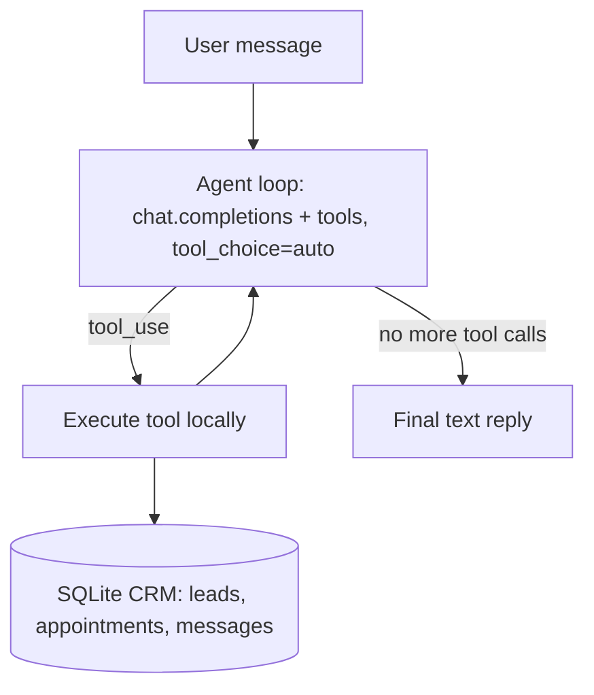

# Architecture

Both the customer and internal agents share the same loop
(`src/sales_agent/agent.py`) — only the system prompt and tool set differ. The loop
caps at `MAX_TOOL_TURNS` to avoid runaway tool-call chains.
